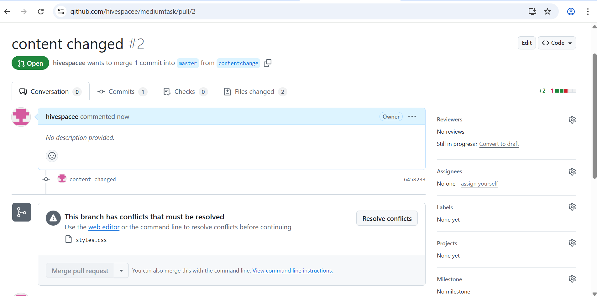
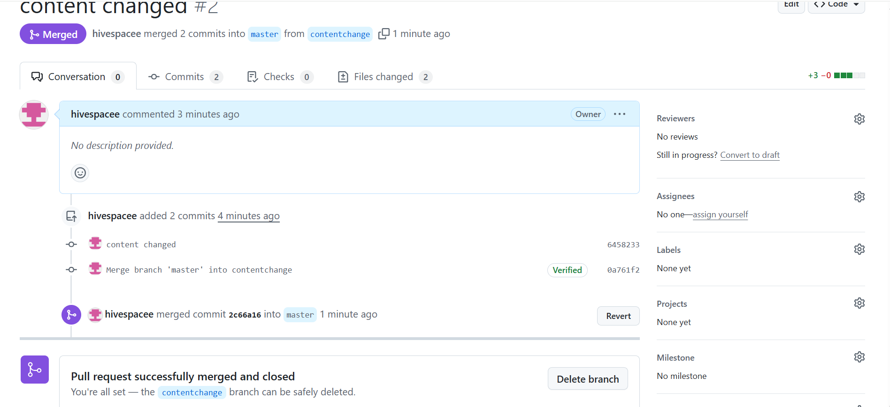

## screenshots of merge conflicts and resolving it

## explanation of things done
created a new repo in git, 
created html and css file with required basic code, 
pushed the content to repo, 
then created two new branches named stylechange and contentchange, 
done some changes based on branches change and while pushing it in git again,
got a pull requests where first merge didnt get any conflict but faced the conflict with second merge and resolved it, 
screenshots are attached 